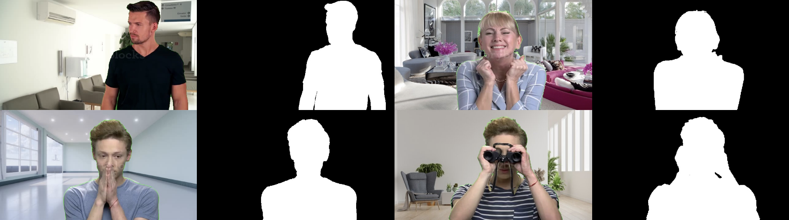

# End-to-end-ConferenceVideoSegmentation-Project

[Video Conference Segmentation Dataset](https://github.com/kuangzijian/Flow-Based-Video-Segmentation)

<p align="center">
  
  <p align="center"><i>Figure 1. Dataset samples</i></p>
</p>

## Codes

The model architecture codes:

* [U-Net Model](https://github.com/knrl/End-to-end-ConferenceVideoSegmentation-Project/blob/main/models/unet.py)
* [U2-Net Model](https://github.com/knrl/End-to-end-ConferenceVideoSegmentation-Project/blob/main/models/u2net.py)

Dataset, training and test codes:

* [Data Manager](https://github.com/knrl/End-to-end-ConferenceVideoSegmentation-Project/blob/main/data_manager.py)
* [Main](https://github.com/knrl/End-to-end-ConferenceVideoSegmentation-Project/blob/main/main.py)
* [Run Experiments](https://github.com/knrl/End-to-end-ConferenceVideoSegmentation-Project/blob/main/run_experiment.py)


## Citation
```
      @inproceedings{Sun_CVPR_2018,
          author = {Deqing Sun and Xiaodong Yang and Ming-Yu Liu and Jan Kautz},
          title = {{PWC-Net}: {CNNs} for Optical Flow Using Pyramid, Warping, and Cost Volume},
          booktitle = {IEEE Conference on Computer Vision and Pattern Recognition},
          year = {2018}
      }
```
```
      @InProceedings{Qin_2020_PR,
          title = {U2-Net: Going Deeper with Nested U-Structure for Salient Object Detection},
          author = {Qin, Xuebin and Zhang, Zichen and Huang, Chenyang and Dehghan, Masood and Zaiane, Osmar and Jagersand, Martin},
          journal = {Pattern Recognition},
          volume = {106},
          pages = {107404},
          year = {2020}
      }
``` 
```
      @misc{U-Net,
          author = {Olaf Ronneberger, Philipp Fischer, Thomas Brox},
          title = {U-Net: Convolutional Networks for Biomedical Image Segmentation},
          year = {2015},
          howpublished = {\url{https://arxiv.org/abs/1505.04597}}
      }
```  
